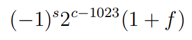

# Double-precision-to-decimal converter

## Background
 IEEE 754 standard 64-bit double precision is a number format occupying  64 bits in computer memory.
 The IEEE 754 standard specifies a binary64 as having:

 - Sign bit: 1 bit
 - Characteristic: 11 bits
 - Significand precision: 53 bits (52 explicitly stored)

### Example

0 10111001000 1011100100010000000000000000000000000000000000000000

The first bit is a sign indicator.
This is followed by an 11-bit exponent, called the characteristic
52-bit binary fraction, called the mantissa.

The formula used to calculate the floating point number from the 64 bit is as follows:

