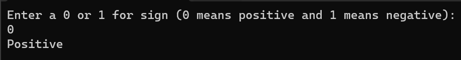
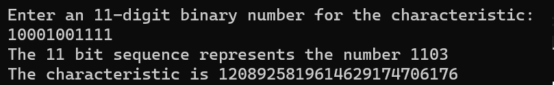
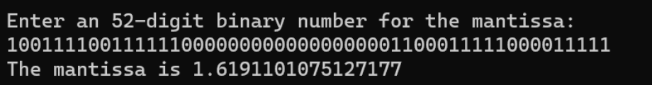

# Double-precision-to-decimal converter

## Background
 IEEE 754 standard 64-bit double precision is a number format occupying  64 bits in computer memory.
 The IEEE 754 standard specifies a binary64 as having:

 - Sign bit: 1 bit
 - Characteristic: 11 bits
 - Mantissa: 52 bits

### Example
If you understand how to works skip to 
0 10111001000 1011100100010000000000000000000000000000000000000000

The first bit is a sign indicator, denoted *s*.
This is followed by an 11-bit exponent, denoted as *c*,called the characteristic
52-bit binary fraction, denoted as *f*,called the mantissa.

The formula used to calculate the floating point number from the 64 bit is as follows:


## Program usage
The *executable file* is located in **"~\Double precision converter\dist\main.exe"**

Enter the first bit indicating the sign:

```Python
Enter a 0 or 1 for sign (0 means positive and 1 means negative):
0
```
### Output
```Python
Positive
```


```Python
Enter the next 11 characteristic bits (spaces are allowed):
10000000011
```
### Output
```Python
The 11 bit sequence represents the number 1027
The characteristic is 16
```



```Python
Enter the next 52 mantissa bits (spaces are allowed):
1011100100010000000000000000000000000000000000000000
```
 ### Output
 ```Python
The mantissa is 1.722900390625

The decimal number is: 27.56640625
```


